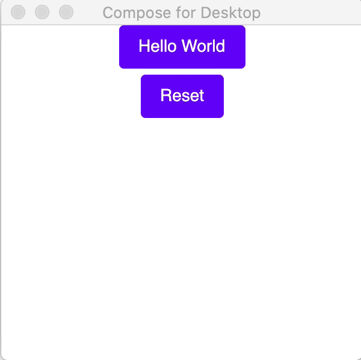

# Code For Desktop
This is a collection of projects I'm experimenting on as I learn about Jetpack's new release of Compose for Desktop.
This is a modern UI framework for Kotlin that makes building performant and beautiful user interfaces easy and enjoyable.
It's worth noting that this framework provides a declarative and reactive approach to creating interfaces with an API inspired by other modern frameworks like React and Flutter.
At it's core, Coompose for Desktop allows you to declare your desktop UI in code by combining composable functions.

